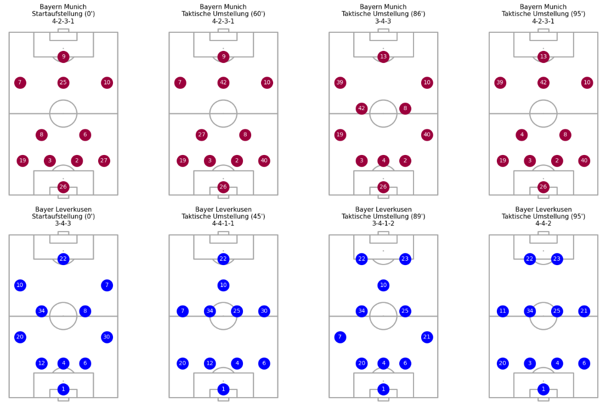
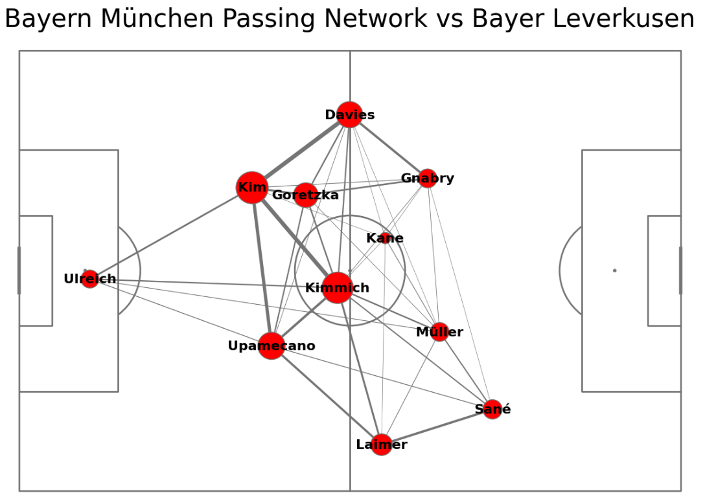
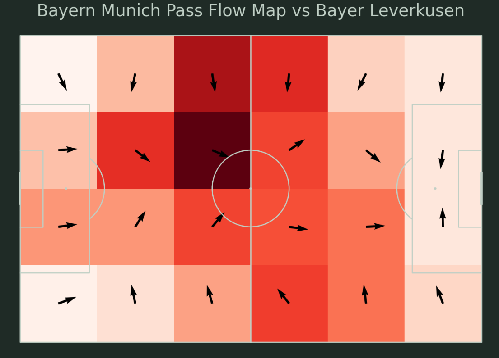
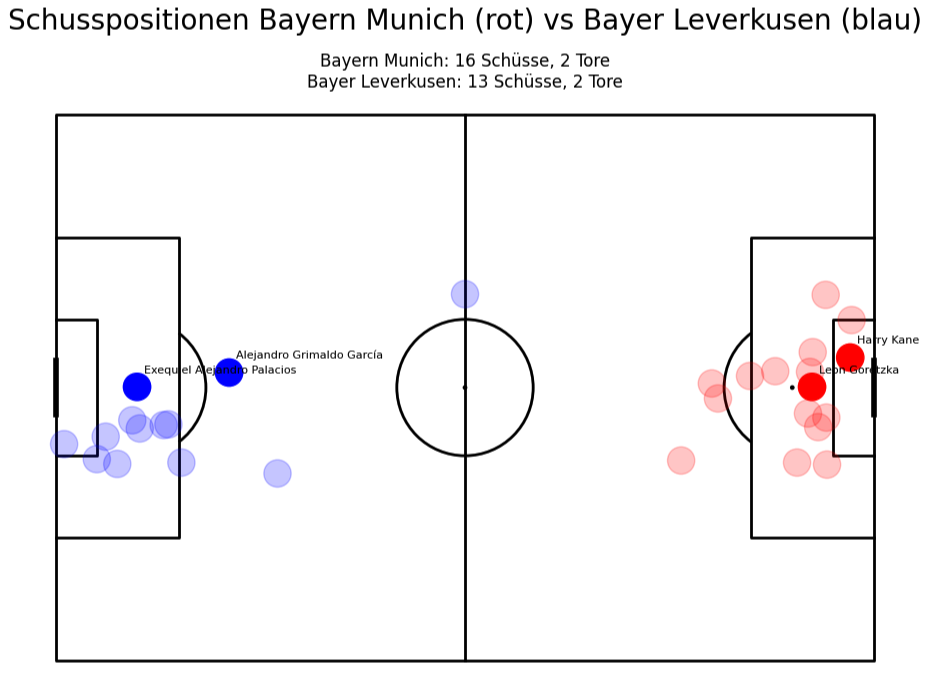

# ⚽ Fußball-Spielanalyse mit StatsBomb & mplsoccer

Dieses Projekt enthält mehrere Jupyter-Notebooks zur datengetriebenen Analyse eines Fußballspiels mithilfe von [StatsBomb Open Data](https://github.com/statsbomb/statsbombpy) und der Visualisierungsbibliothek [`mplsoccer`](https://mplsoccer.readthedocs.io/en/latest/).

Als Beispielspiel wurde das Spiel Bayern München gegen Bayer Leverkusen aus der Hinrunde 2023/2024 verwendet (Statsbomb-Match-ID: `3895074`).

---

## 📚 Inhalt der Notebooks

### 1. 📋 `Aufstellungen.ipynb` – **Startaufstellungen beider Teams**
- Visualisierung der Startformationen beider Teams (z. B. 4-2-3-1)
- Dargestellt auf nebeneinander liegenden vertikalen Spielfeldern
- Spielerpositionen, Rückennummern und Namen


---

### 2. 🔁 `Taktische_Aenderungen_im_Spiel.ipynb` – **Formationsänderungen im Spielverlauf**
- Zeigt für beide Teams:
  - Startaufstellung
  - Alle gemeldeten Taktikwechsel (`Tactical Shift`)
- Jede Formation auf eigenem Mini-Pitch
- Vergleich von taktischen Anpassungen möglich



---

### 3. 🔗 `Pass_Network.ipynb` – **Passing Network**
- Zeigt das Passverhalten von Bayern bis zur ersten Auswechslung
- Kreisgröße = Anzahl der Pässe pro Spieler  
- Linien = Häufigkeit zwischen Spielerpaaren  
- Liefert Einblick in Passmuster und zentrale Spieler



---

### 4. 🌊 `Passflow.ipynb` – **Pass Flow Maps für beide Teams**
- Heatmap + Richtungspfeile für alle Pässe jedes Teams
- Raster-basierte Aggregation des Passverhaltens
- Teamfarben: Rot & Blau, Darstellung im Darkmode-Design



---

### 5. 🔥 `Taktische_Heatmap.ipynb` – **Heatmaps der Ballannahmen pro Position**
- Kombination aus Startformation und Positions-Heatmaps
- Für jede Position: Wo hat der Spieler Bälle angenommen?
- Ideal zur Analyse von Spielerrollen und Raumverhalten


---

### 6. 🎯 `Visualisierung_Schusspositionen.ipynb` – **Schusspositionen und Tore**
- Darstellung aller Schüsse beider Teams
- Treffer = volle Farbe + Name, Fehlversuche = transparent
- Schüsse des gegnerischen Teams werden gespiegelt
- Inklusive Zusammenfassung der Schuss- und Toranzahl



---

## Projektstruktur
```text
football_spielanalyse_with_statsbombData/
├── Aufstellungen.ipynb                      # Visualisiert Startformationen
├── Pass_Network.ipynb                       # Erstellt Passing Network von Bayern München
├── Passflow.ipynb                           # Heatmaps + Richtungspfeile der Pässe
├── Taktische_Aenderungen_im_Spiel.ipynb`    # Taktische Umstellungen im Zeitverlauf
├── Taktische_Heatmap.ipynb                  # Heatmaps der Ballannahmen pro Position
├── Visualisierung_Schusspositionen.ipynb    # Shotmap mit Toranzeige
└── README.md                                # Diese Projektbeschreibung
```
